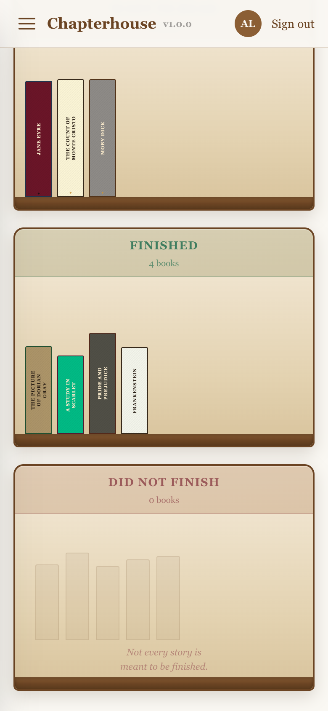
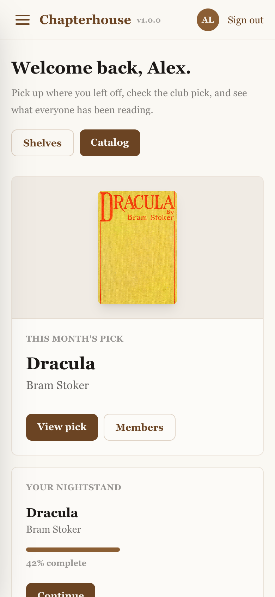
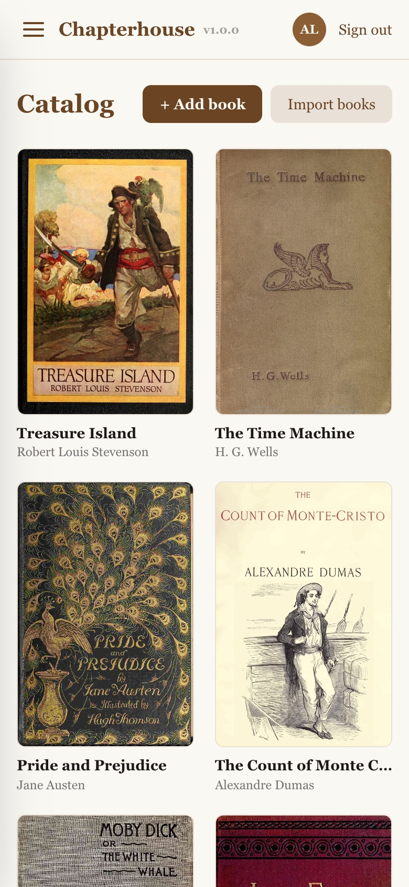

# Chapterhouse

Chapterhouse is a small, self-hosted reading app for you and a few friends.
Think of it as a book club that runs on your own server. It has an EPUB reader
that keeps track of where you are, a shared catalog, a monthly club pick,
bookcase-style shelves, and an activity feed so you can see what everyone's
reading. One instance runs one club.

It's private by design: people join with an invite code, and the books are EPUB
files you add yourself.

<p align="center">
  
  
  
  
</p>

## How it's different from Calibre-Web, Kavita, and friends

Those are libraries. Chapterhouse is a book club, which is a different thing.

Calibre-Web, Kavita, and Komga are great at managing and reading a big personal
or family library, with real catalog management, format handling, and OPDS. If
that's what you want, use one of them. Chapterhouse isn't trying to replace them
and runs fine alongside them.

What I wanted instead was the social side of reading with a few friends, which
those tools mostly leave out:

- One club per instance. A private, invite-only group, not a library for your
  whole family or the internet.
- A monthly pick everyone reads at the same time.
- An activity feed, so you can see when friends start, make progress on, or
  finish a book.
- Shelves (want to read / reading / finished / DNF) that also work as a little
  profile other members can browse.

A few things it doesn't do, on purpose. If you need any of these, reach for one
of the tools above instead: huge libraries and catalog management, comics or
manga, audiobooks, format conversion, or OPDS out to other reading apps.
Chapterhouse reads EPUBs in the browser and stops there.

## Quick start (Docker)

All you need is Docker. There's no account to create ahead of time, no config
files, and no secrets to generate:

```bash
mkdir chapterhouse && cd chapterhouse
curl -LO https://raw.githubusercontent.com/dillon-webster/chapterhouse/main/docker-compose.yml
docker compose up -d
```

Open `http://localhost:3000` (or your server's address). The setup wizard walks
you through creating your admin account and gives you an invite code for your
friends.

> **Just running it?** You don't need to clone the repo. The three commands
> above pull the prebuilt image, and that's all you need. Clone only if you want
> to build from source (`docker compose up -d --build`) or work on the code.

To build the app image yourself instead:

```bash
git clone https://github.com/dillon-webster/chapterhouse.git
cd chapterhouse
docker compose up -d --build
```

**Adding books:** as an admin, open **Catalog → Upload EPUBs** and pick one or
more `.epub` files. No shell or server access needed. Covers, page counts, and
shelf spines are pulled out of the files automatically.

If you'd rather bulk-load a big library from disk, drop `.epub` files into the
`storage/epubs/` directory next to your compose file, then click **Import
books** in the app. Point `STORAGE_HOST_PATH` at a bigger drive if you want the
library to live somewhere with more room (see the options table below).

### Options (all optional)

Set these in a `.env` file next to `docker-compose.yml`:

| Variable | Default | Purpose |
| --- | --- | --- |
| `APP_PORT` | `3000` | Host port to serve on |
| `STORAGE_HOST_PATH` | `./storage` | Where EPUBs/covers/avatars live; point at a big drive |
| `POSTGRES_PASSWORD` | `chapterhouse` | Database password (internal network only, but set your own) |
| `AUTH_SECRET` | auto-generated | Session signing secret; generated and persisted on first boot |
| `AUTH_URL` | request host | Only needed if host detection misbehaves behind your proxy |

### How friends connect

It doesn't matter how traffic reaches Chapterhouse, so use whatever fits your
setup:

- **Tailscale** (great for a private club): friends install Tailscale, and you
  either invite them to your tailnet or [share the server
  node](https://tailscale.com/kb/1084/sharing) with their own (free) accounts.
  `tailscale serve` on the host gets you HTTPS with no certificate work, and
  nothing is ever exposed to the public internet.
- **Reverse proxy + domain** (Caddy, Traefik, Nginx Proxy Manager): the classic
  route. Proxy your domain to the app port; the app trusts the forwarded host
  (`AUTH_TRUST_HOST` is preset). Signup still requires your invite code, so
  being reachable on the internet doesn't mean being open.
- **Cloudflare Tunnel**: a public HTTPS URL without opening any ports.

> **How I run it:** on a home server, with friends added to my own tailnet. Once
> they're on it they just hit the server's Tailscale name on port 3000 and
> they're in. No reverse proxy, no domain, nothing open to the internet. I don't
> bother with `tailscale serve`, it's just plain HTTP over the tailnet and that's
> been fine, home-screen install and all.

If sign-in redirects ever go to the wrong host behind a proxy, set `AUTH_URL`
to your public URL.

### Add it to your home screen

Chapterhouse is a PWA, so members can install it and run it like a native app:
full-screen, no browser chrome, its own home-screen icon. Here are the steps to
pass along to your club:

- **iPhone / iPad (Safari):** open the site in **Safari**, tap the **Share**
  button, then **Add to Home Screen** → **Add**.
- **Android (Chrome):** open the site in **Chrome**, tap the **⋮** menu, then
  **Add to Home screen** / **Install app** (Chrome may also offer an install
  prompt on its own).

Launching from that icon opens Chapterhouse on its own, in portrait, just like
an app.

**Upgrading:** run `docker compose pull && docker compose up -d`. Migrations run
automatically on startup.

**Backups:** dump the `db` service's Postgres and copy your storage directory.
That's everything.

## Using Chapterhouse

Once it's running, this is the loop you and your club will use day to day, plus
what to tell new members.

**Inviting people.** Setup gave you an invite code. Send friends your instance's
address, they open it and hit **Sign up**, then enter that code along with a
username and password. No email, no approval step; the code is the only thing
gating signup. You can find or rotate it later in admin settings.

**Reading.** Open a book from the **Catalog** and hit read. It opens in the
built-in EPUB reader, with no downloads or separate apps. Your place is saved as
you go, so you can close the tab, come back later, or switch from your phone to
your laptop and pick up where you left off.

**Shelves.** Every book lands on one of four shelves: **Want to read**,
**Reading**, **Finished**, or **DNF**. Starting a book moves it to Reading on
its own, and you can move things by hand too. Your shelves double as a little
profile the rest of the club can browse.

**The monthly pick.** Admins can open a book and set it as the current pick,
which puts it front and center on everyone's dashboard as the shared read.
That's the one thing reserved for admins; everything else works the same for
everyone.

**The activity feed.** The dashboard shows who's started, made progress on, or
finished a book lately. It's the part that makes it feel like a club instead of
a folder of files. Tap someone to see their profile and shelves.

## Stack

- **Next.js 16** (App Router), **TypeScript**, and **Tailwind CSS**
- **Prisma 7** and **PostgreSQL** (via the `pg` driver adapter)
- **NextAuth v5** (Auth.js): Credentials provider, JWT sessions, bcrypt hashes
- **epub.js** for in-browser EPUB rendering
- **Docker**: prebuilt multi-arch images (amd64/arm64) on GHCR

## Local development

Prerequisites: Node 20+, a running PostgreSQL.

```bash
# 1. Install deps
npm install

# 2. Configure env
cp .env.example .env          # defaults work for a local Postgres

# 3. Create the database (if it doesn't exist) and apply the schema
createdb chapterhouse         # or: psql -c 'CREATE DATABASE chapterhouse;'
npm run db:migrate            # creates tables from prisma/schema.prisma

# 4. Run
npm run dev                   # http://localhost:3000 -> setup wizard
```

The first visit walks you through creating the admin account. Or run
`npm run db:seed` to create one from the `SEED_*` vars instead.

## Useful scripts

| Script | Purpose |
| --- | --- |
| `npm run dev` | Dev server |
| `npm run build` / `npm run start` | Production build / serve |
| `npm run typecheck` | `tsc --noEmit` |
| `npm run lint` | ESLint |
| `npm run test` | Unit tests |
| `npm run db:migrate` | Create + apply a dev migration |
| `npm run db:deploy` | Apply migrations (prod / CI) |
| `npm run db:seed` | Seed an admin + invite code (dev convenience) |
| `npm run db:studio` | Prisma Studio |

## Architecture notes

- **Prisma 7**: the DB URL is no longer in `schema.prisma`. The CLI reads it from
  `prisma.config.ts`, and the runtime client gets it via the `pg` adapter in
  `src/lib/prisma.ts`.
- **Auth**: `src/auth.config.ts` is the edge-safe config used by the middleware
  proxy; `src/auth.ts` adds the Credentials provider (Prisma + bcrypt, Node
  runtime).
- **Storage**: all file I/O goes through `src/lib/storage.ts`, so one env var
  (`STORAGE_DIR`) moves content elsewhere.
- **First run**: with zero users, all sign-in paths funnel to `/setup`, which
  creates the admin account and the club's invite code in the browser.

See [`docs/IMPLEMENTATION_PLAN.md`](docs/IMPLEMENTATION_PLAN.md) for the feature
roadmap and current status.

## License

[MIT](LICENSE)
